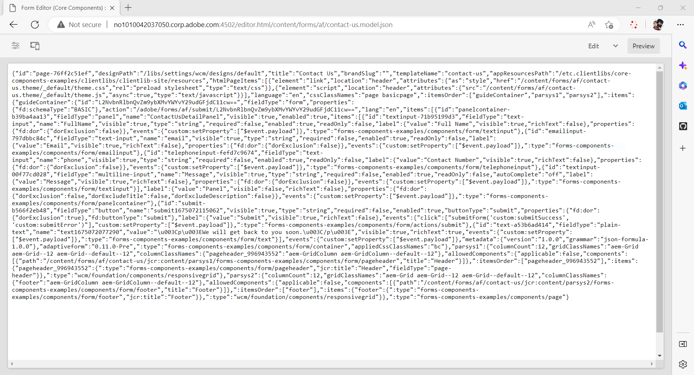

# Criar um formulário adaptável headless usando o editor adaptável do Forms {#create-a-headless-adaptive-form-using-adaptive-forms-editor}

O AEM Forms as a Cloud Service oferece um editor simples para criar Forms adaptável headless. Com mais de 24 componentes principais disponíveis, você pode criar facilmente um formulário arrastando e soltando componentes no editor. Além disso, o editor de regras permite adicionar validações aos campos de formulário.

>[!NOTE]
>
> 
>Se você nunca usou o Forms adaptável headless, a Adobe recomenda que você passe pelo [Criar e publicar um formulário headless usando o kit inicial](create-and-publish-a-headless-form.md) tutorial para saber as noções básicas e artesanato em um formulário adaptável headless antes de usar o editor adaptável do Forms para formulários headless.

Execute as seguintes etapas para criar um formulário adaptável headless usando o editor adaptável do Forms:

## Antes de você iniciar:

Você precisa do seguinte para criar um Formulário adaptável usando o editor Forms adaptável:

**Para o AEM 6.5 Forms:**

* Acesso a uma instância de autor do Forms AEM 6.5.16.0 ou posterior.

* Componentes principais dos formulários adaptáveis

* Modelo dos Componentes principais do Forms adaptável

* Um tema de formulário adaptável para o modelo baseado em Componentes principais

* Adicionar usuários ao [!DNL forms-users] grupo. Os membros do grupo [!DNL forms-users] tem permissões para criar formulários adaptáveis.

**Para o AEM Forms as a Cloud Service:**

* O acesso a um [Instância do autor as a Cloud Service do AEM Forms](https://experienceleague.adobe.com/docs/experience-manager-cloud-service/content/forms/setup-configure-migrate/setup-forms-cloud-service.html?lang=en) ou um [SDK as a Cloud Service do AEM Forms local](https://experienceleague.adobe.com/docs/experience-manager-cloud-service/content/forms/setup-configure-migrate/setup-local-development-environment.html?lang=en) ambiente.

* **Um modelo de formulário adaptável**: um modelo fornece uma estrutura básica e define a aparência (layouts e estilos) de um formulário adaptável. Ele tem componentes pré-formatados que contêm determinadas propriedades e estrutura de conteúdo. Também fornece as opções para definir um tema e uma ação de envio. O tema define a aparência, e a ação de envio define a ação a ser executada no envio de um formulário adaptável. Por exemplo, enviar os dados coletados para uma fonte de dados. O serviço de nuvem fornece um modelo OOTB, chamado de em branco:

   * O modelo `blank Adaptive Forms (Core Components)` está incluído em todos os novos programas do AEM Forms as a Cloud Service.
   * Também é possível [criar um novo modelo de Forms adaptável (Componentes principais)](https://experienceleague.adobe.com/docs/experience-manager-cloud-service/content/forms/adaptive-forms-authoring/authoring-adaptive-forms-foundation-components/create-an-adaptive-form-on-forms-cs/template-editor.html) do zero.

* **Um tema de formulários adaptáveis**: um tema contém detalhes de estilo para os componentes e painéis. Os estilos incluem propriedades como cores de fundo, cores de estado, transparência, alinhamento e tamanho. Ao aplicar um tema, o estilo especificado é refletido nos componentes correspondentes.  O modelo `Canvas` está incluído em todos os novos programas do AEM Forms as a Cloud Service.

* **Permissões**: adicionar usuários ao grupo [!DNL forms-users]. Os membros do grupo [!DNL forms-users] tem permissões para criar formulários adaptáveis. Para obter uma lista detalhada de grupos de usuários específicos dos formulários, consulte [Grupos e permissões](https://experienceleague.adobe.com/docs/experience-manager-cloud-service/content/forms/setup-configure-migrate/forms-groups-privileges-tasks.html).

## Criação de um Formulário adaptável  {#create-an-adaptive-form-components}

1. Faça logon no [!DNL Experience Manager Forms] Instância do autor.

1. Insira suas credenciais na página de logon do Experience Manager. Após fazer logon, e no canto superior esquerdo, toque em **[!UICONTROL Adobe Experience Manager]** > **[!UICONTROL Forms]** > **[!UICONTROL Formulários e documentos]**.

1. Toque em **[!UICONTROL Criar]**  > **[!UICONTROL Formulários adaptáveis]**. O Assistente será aberto. Na guia Origem, selecione um modelo:

   

   Ao selecionar um modelo, o tema e a ação de envio especificados no modelo são selecionados automaticamente e o botão **[!UICONTROL Criar]** será habilitado. Você pode ir para as guias **[!UICONTROL Estilo]** ou **[!UICONTROL Envio]** para selecionar um tema ou uma ação de envio diferente. Se o modelo selecionado não especificar um tema, o botão criar permanecerá desabilitado. É possível ir para a guia **[!UICONTROL Estilos]** para selecionar um tema manualmente.

1. Na guia **[!UICONTROL Estilo]**, selecione um tema:

   * Quando o modelo selecionado especifica um tema, ele é selecionado automaticamente no assistente. Você também pode escolher um tema diferente da guia de Estilo.

   * Se o modelo selecionado não especificar um tema, será possível usar a guia de Estilo para escolher um tema. O botão **[!UICONTROL Criar]** só será ativado depois que um tema for selecionado.

1. (Opcional) Na guia Dados, selecione um modelo de dados:

   * **Modelo de dados do formulário**: um [Modelo de dados do formulário](https://experienceleague.adobe.com/docs/experience-manager-cloud-service/content/forms/integrate/use-form-data-model/data-integration.html) permite integrar entidades e serviços de diferentes fontes de dados a um formulário adaptável. Escolha a opção Modelo de dados de formulário se o formulário adaptável que você está criando envolve a obtenção e gravação de dados de e para várias fontes de dados.

   * **Esquema JSON**: [Esquema JSON](https://experienceleague.adobe.com/docs/experience-manager-cloud-service/content/forms/adaptive-forms-authoring/authoring-adaptive-forms-foundation-components/create-an-adaptive-form-on-forms-cs/adaptive-form-json-schema-form-model.html?lang=en) O formulário adaptável permite uma integração perfeita com o sistema de back-end de sua organização, fornecendo a capacidade de associar um esquema JSON, que representa a estrutura dos dados que estão sendo produzidos ou consumidos. Essa associação permite que os autores adicionem conteúdo dinamicamente ao Formulário adaptável usando os elementos do esquema. Os elementos do esquema são facilmente acessíveis na guia Objetos do modelo de dados do navegador de conteúdo durante o processo de criação e todos os campos são adicionados automaticamente a qualquer formulário adaptável recém-criado.

   Por padrão, todos os campos do esquema JSON associado são selecionados e convertidos automaticamente nos componentes de Formulários adaptáveis correspondentes, simplificando o processo de criação. O assistente oferece a conveniência adicional de permitir a escolha seletiva de quais campos devem ser incluídos no Formulário adaptável usando caixas de seleção.

1. Na guia **[!UICONTROL Envio]**, selecione uma ação de envio:

   * Ao selecionar um modelo, a ação de envio especificada no modelo é selecionada automaticamente. É possível selecionar uma ação de envio diferente na guia Envio. A guia **[!UICONTROL Envio]** exibe todas as ações de envio disponíveis.

   * Quando o modelo selecionado não especificar uma ação de envio, você poderá usar a guia **[!UICONTROL Envio]** para selecionar uma

1. (Opcional) Na guia **[!UICONTROL Entrega]**, é possível especificar uma data de publicação ou cancelamento da publicação para um Formulário adaptável.

1. Toque em **[!UICONTROL Criar]**. Uma caixa de diálogo para especificar o título, o nome e o local para salvar o Formulário adaptável será exibida:

   * **[!UICONTROL Título]** especifica o nome de exibição do formulário. O título ajuda a identificar o formulário na interface do usuário do [!DNL Experience Manager Forms].
   * **[!UICONTROL Nome:]** especifica o nome do formulário. Um nó com o nome especificado será criado no repositório. Ao começar a digitar um título, o valor do campo de nome é gerado automaticamente. É possível alterar o valor sugerido. O campo de nome pode incluir apenas caracteres alfanuméricos, hifens e sublinhados. Todas as entradas inválidas são substituídas por um hífen.
   * **[!UICONTROL Caminho:]** especifica o local no qual o Formulário adaptável deverá ser salvo. É possível salvar o formulário adaptável diretamente em `/content/dam/formsanddocuments` ou criar uma pasta como `/content/dam/formsanddocuments/adaptiveforms` para salvar um Formulário adaptável. Certifique-se de criar a pasta antes de usá-la no caminho. O campo **[!UICONTROL Caminho]** não cria uma pasta automaticamente.

1. Toque em **[!UICONTROL Criar]**. Um Formulário adaptável será criado e aberto no editor de Formulários adaptáveis. O editor exibirá o conteúdo disponível no modelo.  Com base no tipo de formulário adaptável, os elementos de formulário presentes no esquema JSON <!--XFA form template, XML schema or --> associado ou no modelo de dados de formulário são exibidos na guia **[!UICONTROL Objetos do modelo de dados]** do **[!UICONTROL Navegador de conteúdo]** na barra lateral. Também é possível arrastar e soltar esses elementos para criar seu formulário adaptável.

Agora, você pode arrastar e soltar os componentes do Adaptive Forms no contêiner do Adaptive Forms para criar o formulário.

## Exibir a representação JSON de um formulário adaptável {#preview-form}

Selecione o Formulário adaptável e toque em **Visualizar**. A pré-visualização do formulário é exibida. Para exibir a definição de formulário (JSON) do formulário, substitua a extensão .html na URL por .model.json

Por exemplo, http://[author-server]:[porta]/editor.html/content/forms/af/contact-us.model.json

Você pode usar o Forms adaptável headless [getForm](https://opensource.adobe.com/aem-forms-af-runtime/api/#tag/Get-Form-Definition) API para buscar a definição do formulário (JSON) e usá-la no aplicativo.

