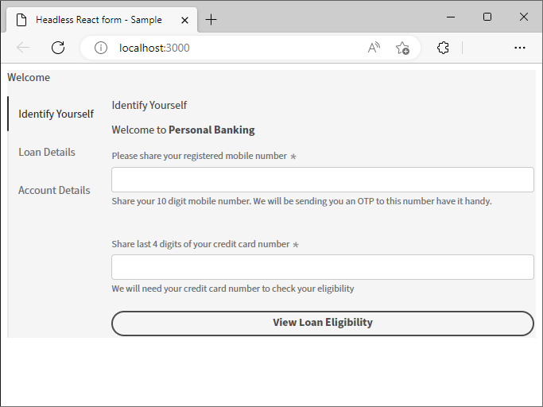
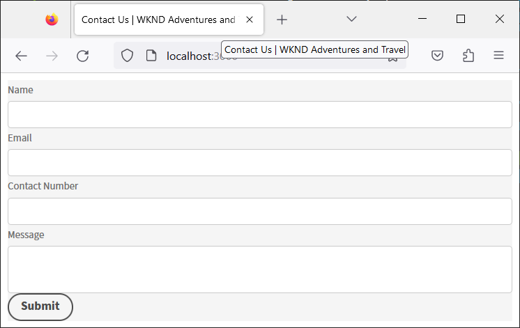

# Criar e visualizar um formulário headless usando um aplicativo React {#introduction}

O kit inicial ajuda você a começar a usar rapidamente um aplicativo React. Você pode desenvolver e usar formulários adaptáveis headless em um Angular, Vanilla JS e outros ambientes de desenvolvimento de sua escolha.

Começar com formulários adaptáveis headless é muito fácil e rápido. Clonar o projeto React pronto, instalar as dependências e executar o projeto. Você tem um formulário adaptável headless integrado a um aplicativo React em funcionamento. Você pode usar o projeto de amostra do react para criar e testar formulários adaptáveis headless antes de implantá-lo em um ambiente de produção.

Vamos começar:

>[!NOTE]
>
>
> Este guia de introdução usa um aplicativo React. Você pode usar a tecnologia ou a linguagem de programação de sua escolha para usar formulários adaptáveis headless.

## Antes de você iniciar {#pre-requisites}

Para criar e executar um aplicativo React, você deve ter o seguinte instalado em seu computador:

* Instale o [última versão do Git](https://git-scm.com/downloads). Se você é novo no Git, consulte [Instalação do Git](https://git-scm.com/book/en/v2/Getting-Started-Installing-Git).

* Instalar [Node.js 16.13.0 ou posterior](https://nodejs.org/en/download/). Se você é novo no Node.js, consulte [Como instalar o Node.js](https://nodejs.dev/en/learn/how-to-install-nodejs).

## Introdução

Depois de atender aos requisitos, execute as seguintes etapas para começar:

1. [Configurar o kit inicial de formulários adaptáveis headless](#setup)

1. [Pré-visualize o formulário adaptável headless incluído no kit inicial](#preview)

1. [Crie e renderize seu próprio formulário adaptável Headless](#custom)


## 1. Configurar o kit inicial de formulários adaptáveis headless {#install}

O kit de início é um aplicativo React com um exemplo de formulário adaptável headless e bibliotecas correspondentes. Use o kit para desenvolver e testar seus formulários adaptáveis headless e os componentes correspondentes do React. Execute os seguintes comandos para configurar o kit de início de formulários adaptáveis headless:

1. Abra o prompt de comando e execute o seguinte comando:

   ```shell
   git clone https://github.com/adobe/react-starter-kit-aem-headless-forms
   ```

   O comando cria um diretório chamado **react-starter-kit-aem-headless-forms** no local atual e clona o aplicativo inicial do React de formulários adaptáveis Headless nele. Juntamente com as configurações e a lista de dependências necessárias para renderizar o formulário, o diretório inclui o seguinte conteúdo importante:

   * **Exemplo de formulário**: O kit inicial inclui um formulário de aplicativo de empréstimo de exemplo. Para exibir o formulário (definição de formulário) incluído no aplicativo, abra a `/react-starter-kit-aem-headless-forms/form-definations/form-model.json` arquivo.
   * **Componentes de reação de exemplo**: o kit inicial inclui componentes de reação de amostra para Rich text e Slider. Este guia ajuda você a criar seus próprios componentes personalizados usando esses componentes Rich text e Slider.
   * **Mapeamentos.ts**: o arquivo mappings.ts ajuda a mapear componentes personalizados com campos de formulário. Por exemplo, mapeie um campo de passo numérico com componente de classificações.
   * **Configurações do ambiente**: as configurações de ambiente permitem renderizar um formulário incluído no kit inicial ou buscar um formulário de um servidor do AEM Forms.

   

   >[!NOTE]
   >
   > 
   > Exemplos em documentos são baseados em VSCode. Você pode usar qualquer editor de código de texto simples.


1. Navegue até a **react-starter-kit-aem-headless-forms** e execute o seguinte comando para instalar as dependências:

   ```shell
   npm install
   ```

   O comando baixa todos os pacotes e bibliotecas necessários para executar e criar o aplicativo, como bibliotecas de formulários adaptáveis headless (@aemforms/af-response-renderer, @aemforms/af-response-components, @adobe/react-spectrum), executa validações e mantém dados para instâncias do formulário.

   


## 2. Visualizar o formulário adaptável headless {#preview}

Depois de configurar o kit de início, você pode visualizar o formulário adaptável headless de amostra, substituí-lo pelo seu próprio formulário personalizado. Você também pode configurar o kit inicial para recuperar um formulário de um servidor do AEM Forms. Para visualizar o formulário

1. Renomeie o `env_template` arquivo para `.env` arquivo. Além disso, verifique se a opção USE_LOCAL_JSON está definida como true.

   

   <!-- The options in the .env file help you configure source of the forms definantion (.JSON):
    *  To source forms definantion (.JSON) from an AEM Server, set USE_LOCAL_JSON option to false, use the AEM_URL option to specify URL  of your AEM Server, and set the AEM_FORM_PATH option to path of your adaptive form.
    *  To source forms definantion (.JSON) form-model.json file included in the starter-kit, set USE_LOCAL_JSON option to false. -->

1. Use o seguinte comando para executar o aplicativo:

   ```shell
     npm start
   ```


   Esse comando inicia um servidor de desenvolvimento local e abre o formulário adaptável headless de amostra, incluído no aplicativo inicial, no navegador da Web padrão.

   

   Voila! Você está configurado para começar a desenvolver um formulário adaptável headless personalizado.

   <!--  As you know, in a headless form the form data and logic are separate from the presentation layer and can be used by any client that can make HTTP requests, such as a mobile app, a static site, or a different web application. The form is often managed and stored on a server, which serves as the backend for the form. The client sends requests to the server to retrieve the form, submit data, and receive updated form data. This allows for greater flexibility and integration with different technologies. You can store and retrive a Headless adaptive form on an AEM Server  -->

## 3. Crie e renderize seu próprio formulário adaptável Headless{#custom}

Um formulário adaptável headless representa o formulário e seus componentes, como campos e botões, no formato JSON (JavaScript Object Notation). A vantagem de usar o formato JSON é que ele pode ser facilmente analisado e usado por várias linguagens de programação, tornando-se uma maneira conveniente de trocar dados de formulário entre sistemas. Para visualizar o exemplo de formulário adaptável headless incluído no aplicativo, abra o `/react-starter-kit-aem-headless-forms/form-definations/form-model.json` arquivo.

Vamos criar um formulário de contato conosco com quatro campos: &quot;Nome&quot;, &quot;Email&quot;, &quot;Número de contato&quot; e &quot;Mensagem&quot;. Os campos são definidos como objetos (itens) no JSON, com cada objeto (item) tendo propriedades como tipo, rótulo, nome e obrigatório. O formulário também tem um botão do tipo &quot;enviar&quot;. Este é o JSON para o formulário.


```JSON
{
  "afModelDefinition": {
    "adaptiveform": "0.10.0",
    "items": [
      {
        "fieldType": "text-input",
        "label": {
          "value": "Name"
        },
        "name": "name"
      },
      {
        "fieldType": "text-input",
        "format": "email",
        "label": {
          "value": "Email"
        },
        "name": "email"
      },
      {
        "fieldType": "text-input",
        "format": "phone",
        "pattern": "[0-9]{10}",
        "label": {
          "value": "Contact Number"
        },
        "name": "Phone"
      },
      {
        "fieldType": "multiline-input",
        "label": {
          "value":"Message"
        },
        "name": "message"
      },
      {
        "fieldType": "button",
        "label":{
          "value": "Submit"
        },
        "name":"submit",
        "events":{
          "click": "submitForm()"
        }
      }
    ],
    "action": "https://eozrmb1rwsmofct.m.pipedream.net",
    "description": "Contact Us",
    "title": "Contact Us",
    "metadata": {
      "grammar": "json-formula-1.0.0",
      "version": "1.0.0"
    }
  }
}
```

>[!NOTE]
>
> * O atributo &quot;afModelDefinition&quot; é necessário apenas para aplicativos React e não faz parte da definição do formulário.
> * Você pode criar manualmente o formulário JSON ou usar o [Editor de formulários adaptáveis para AEM (editor WYSIWYG de formulários adaptáveis)](create-a-headless-adaptive-form.md) para criar e entregar o formulário JSON. Em um ambiente de produção, você usa o AEM Forms para fornecer o formulário JSON, mais informações sobre ele posteriormente.
> * O tutorial usa o https://pipedream.com/ para testar os envios de formulários. Você usa endpoints próprios ou de terceiros aprovados pela organização para receber os dados de um Formulário adaptável headless.


Para renderizar o formulário, substitua a amostra de formulário adaptável headless JSON `/react-starter-kit-aem-headless-forms/form-definations/form-model.json` com o JSON acima, salve o arquivo e aguarde o kit inicial compilar e atualizar o formulário.


<!-- Your form is ready. Let's add some validations and make "Name", "Email", and "Message" fields mandatory. -->

Você renderizou com êxito o Formulário adaptável headless.


## Bônus

Vamos definir o título da página da Web que hospeda o formulário como `Contact Us | WKND Adventures and Travel`. Para alterar o título, abra o _react-starter-kit-aem-headless-forms/public/index.html_ arquivo para edição e defina o título.




## Próxima etapa

Por padrão, o kit inicial usa [Adobe Espectro](https://spectrum.adobe.com/) componentes para renderizar o formulário. Você pode usar a opção criar e usar seus próprios componentes ou componentes de terceiros. Por exemplo, usando a Google Material UI ou a Chakra UI.

Vamos [usar a interface do usuário de material do Google](use-google-material-ui-react-components-to-render-a-headless-form.md) para renderizar nosso formulário Fale Conosco.


