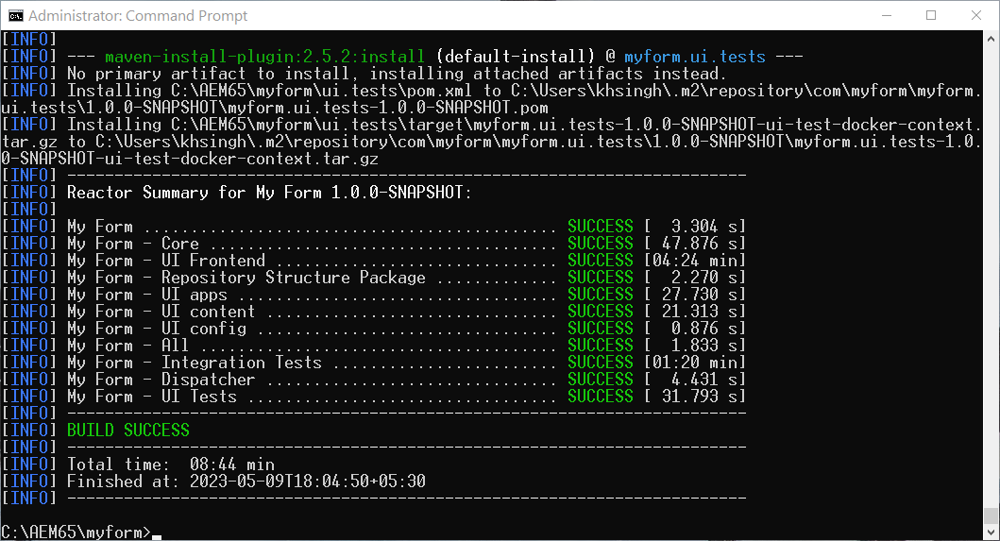

# Ativar o Forms adaptável headless no AEM 6.5 Forms {#enable-headless-adaptive-forms-on-aem-65-forms}

Para ativar o Headless Adaptive Forms no ambiente do Forms AEM 6.5, configure um projeto com base no Arquétipo 41 ou posterior do AEM e implante-o em todas as instâncias de Autor e Publicação.

Ao implantar o projeto com base no Arquétipo AEM 41 ou posterior nas instâncias do AEM 6.5 Forms, você obtém a capacidade de [criar Componentes principais com base no Forms adaptável](create-a-headless-adaptive-form.md). Esses formulários são representados no formato JSON e usados como Headful e Headless Adaptive Forms, permitindo maior flexibilidade e personalização em uma variedade de canais, incluindo aplicativos móveis, da Web e nativos.

## Pré-requisitos {#prerequisites}

Antes de ativar o Forms adaptável headless no ambiente Forms AEM 6.5,

* [Atualizar para AEM 6.5 Forms Service Pack 16 (6.5.16.0) ou posterior](https://experienceleague.adobe.com/docs/experience-manager-65/release-notes/aem-forms-current-service-pack-installation-instructions.html).

* Instale a versão mais recente do [Apache Maven](https://maven.apache.org/download.cgi).

* Instale um editor de texto simples. Por exemplo, Microsoft Visual Studio Code.

## Criar e implantar o projeto mais recente baseado no Arquétipo AEM

Para criar um Arquétipo AEM 41 ou [posteriormente](https://github.com/adobe/aem-project-archetype) projeto baseado em e implantá-lo em todas as suas instâncias de Autor e Publicação:

1. Faça logon no computador, hospedando e executando a instância do Forms AEM 6.5, como Administrador.
1. Abra o prompt de comando ou o terminal.
1. Execute o seguinte comando para criar um projeto baseado no Arquétipo AEM 41:

   * Microsoft Windows

   ```Shell
      mvn -B org.apache.maven.plugins:maven-archetype-plugin:3.2.1:generate ^
      -D archetypeGroupId=com.adobe.aem ^
      -D archetypeArtifactId=aem-project-archetype ^
      -D archetypeVersion=41 ^
      -D appTitle="My Form" ^
      -D appId="myform" ^
      -D groupId="com.myform" ^
      -D includeFormsenrollment="y" ^
      -D aemVersion="6.5.15" 
   ```

   * Linux ou Apple macOS

   ```Shell
      mvn -B org.apache.maven.plugins:maven-archetype-plugin:3.2.1:generate \
      -D archetypeGroupId=com.adobe.aem \
      -D archetypeArtifactId=aem-project-archetype \
      -D archetypeVersion=41 \
      -D appTitle="My Form" \
      -D appId="myform" \
      -D groupId="com.myform" \
      -D includeFormsenrollment="y" \
      -D aemVersion="6.5.15" 
   ```

   Ao executar o comando acima, considere os seguintes pontos:

   * Atualize o comando para refletir os valores específicos do seu ambiente, incluindo appTitle, appId e groupId. Além disso, defina os valores de includeFormsenrollment como &#39;y&#39;. Se você usa o Forms Portal, defina a variável _includeExamples=y_ opção para incluir os Componentes principais do Forms Portal no projeto.

   * Não altere a &quot;aemVersion&quot; da versão 6.5.15.0 para outra.

1. (Somente para projetos baseados no Arquétipo versão 41) Depois que o projeto Arquétipo AEM for criado, ative temas para o Forms adaptável baseado em Componentes principais. Para ativar temas:

   1. Abra o [Pasta de projeto do arquétipo AEM]/ui.apps/src/main/content/jcr_root/apps/__appId__/components/adaptiveForm/page/customheaderlibs.html para edição:

   1. Adicione o seguinte código na linha 21:

      ```XML
      <sly data-sly-use.clientlib="core/wcm/components/commons/v1/templates/clientlib.html"
      data-sly-use.formstructparser="com.adobe.cq.forms.core.components.models.form.FormStructureParser"
      data-sly-test.themeClientLibRef="${formstructparser.themeClientLibRefFromFormContainer}">
      <sly data-sly-test="${themeClientLibRef}" data-sly-call="${clientlib.css @ categories=themeClientLibRef}"/>
      </sly>
      ```

      

   1. Salvar e fechar o arquivo.

1. Atualize o projeto para incluir a versão mais recente dos Componentes principais do Forms:

   1. Abra o [Pasta de projeto do arquétipo AEM]/pom.xml para edição.
   1. Definir versão de `core.forms.components.version` e `core.forms.components.af.version` para [Componentes principais mais recentes do Forms](https://github.com/adobe/aem-core-forms-components/tree/release/650) versão.

      

   1. Salvar e fechar o arquivo.


1. Depois que o projeto do Arquétipo AEM for criado com êxito, crie o pacote de implantação para o seu ambiente. Para criar o pacote:

   1. Navegue até o diretório raiz do projeto do Arquétipo AEM.


   1. Execute o seguinte comando para criar o projeto do Arquétipo AEM para o seu ambiente:

      ```Shell
      mvn clean install
      ```

      


   Depois que o projeto do Arquétipo AEM é criado com êxito, um pacote AEM é gerado. Você pode encontrar o pacote em [Pasta de projeto do arquétipo AEM]\all\target\[appid].all-[version].zip

1. Use o [Gerenciador de pacotes](https://experienceleague.adobe.com/docs/experience-manager-65/administering/contentmanagement/package-manager.html?lang=pt-BR) para implantar o [Pasta de projeto do arquétipo AEM]\all\target\[appid].all-[version]pacote .zip em todas as instâncias Autor e Publicar.

>[!NOTE]
>
>
>
>Caso encontre dificuldades ao acessar a caixa de diálogo de logon em uma instância de publicação para instalar o pacote por meio do Gerenciador de pacotes, tente fazer logon por meio do seguinte URL: http://[URL do servidor de publicação]:[PORTA]/system/console. Isso permite que você acesse e faça logon na instância de publicação, o que permite prosseguir com o processo de instalação.


Os Componentes principais são ativados para o seu ambiente. Um modelo de Formulário adaptável e um tema da Tela 3.0 em branco dos Componentes principais são implantados em seu ambiente, permitindo [criar Componentes principais com base no Forms adaptável](create-a-headless-adaptive-form.md).

## Perguntas frequentes

### Quais são os componentes principais?

A variável [Componentes principais](https://experienceleague.adobe.com/docs/experience-manager-core-components/using/introduction.html?lang=pt-BR) são um conjunto de componentes padronizados de Gerenciamento de Conteúdo na Web (WCM, na sigla em inglês) para o AEM a fim de acelerar o tempo de desenvolvimento e reduzir o custo de manutenção de seus sites.

### Quais são os recursos adicionados à habilitação dos componentes principais?


Quando os Componentes principais do Forms adaptável estiverem ativados para seu ambiente, um modelo de Formulário adaptável baseado em Componentes principais em branco e o tema do Canvas 3.0 serão adicionados ao seu ambiente. Depois de ativar os Componentes principais adaptáveis do Forms no seu ambiente, você pode:

* Crie Componentes principais com base no Forms adaptável.
* Crie Componentes principais com base em modelos de formulário adaptável.
* Crie temas personalizados para os Componentes principais com base em modelos de Formulário adaptável.
* Servir representações JSON do Formulário adaptável com base no Componente principal para canais como dispositivos móveis, Web, aplicativos nativos e serviços que exigem a representação headless de um formulário.
