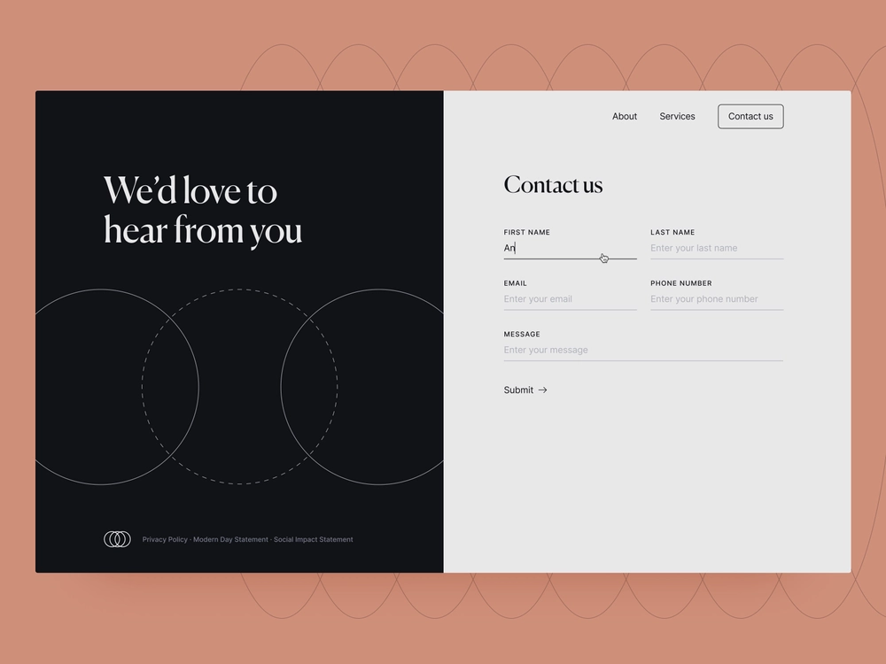

# Introdução ao Headless Adaptive Forms

Este tutorial fornece uma estrutura completa para criar um formulário adaptável headless. O tutorial é organizado em um caso de uso e em vários guias. Cada guia ajuda você a aprender e adicionar novos recursos ao formulário adaptável headless criado neste tutorial. Você tem um formulário adaptável headless funcional após cada guia. Ao final deste tutorial, você será capaz de:

* Criar um formulário adaptável headless
* Adicionar regras de negócios ao formulário
* Usar a interface do usuário de material do Google para criar estilos de formulários
* Preencha o formulário previamente 
* Incorporar o formulário a uma página da Web

Você também criará uma compreensão da arquitetura, dos artefatos disponíveis e da estrutura JSON de formulários adaptáveis headless.

**A jornada começa aprendendo o caso de uso**:

Raya Tan, membro do departamento de relações exteriores de um país conhecido por sua beleza natural e economia de turismo próspera, supervisiona a distribuição de formulários de visto para turistas. Esses formulários estão disponíveis no site do departamento, em aplicativos nativos para dispositivos móveis e no formato PDF, com várias opções de idioma para os turistas escolherem. No entanto, gerenciar e dimensionar esses formulários em diferentes plataformas e tecnologias pode ser desafiador.

A fim de melhorar a eficiência e a flexibilidade do processo de solicitação de visto, o departamento de Relações Exteriores decidiu adotar uma abordagem de formulários adaptáveis headless. Essa arquitetura dissociada separa o front-end do back-end, permitindo maior personalização e escalabilidade. O departamento planeja usar os componentes do React da interface do material do Google para aprimorar a experiência do usuário dos formulários, enquanto utiliza recursos de back-end, como assinaturas digitais, integração de dados, gerenciamento de processos comerciais, documento de registro e análise de uso.

A forma mais popular entre os turistas é o formulário &quot;Contate-nos&quot;, que é usado para fazer várias perguntas e perguntas. Assim, o departamento de relações exteriores optou por começar a implementar a abordagem de formulários adaptáveis headless com este formulário. Este tutorial guiará você pelo processo de criação do formulário Fale Conosco usando esta nova arquitetura. O resultado final terá esta aparência:

