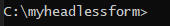
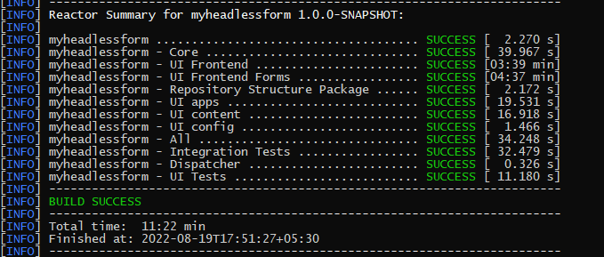
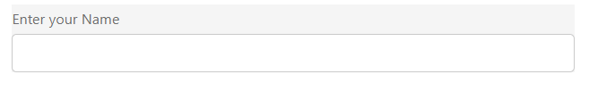
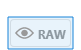
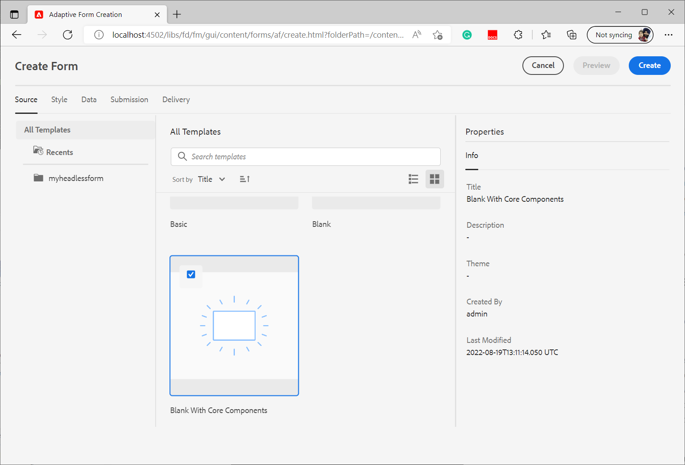

# Crie seu primeiro formulário adaptável headless

Você pode usar os formulários adaptáveis do Adobe Experience Manager Headless para criar aplicativos de formulários usando a interface do usuário front-end, como o React, e usar o SDK da Web da Forms para recursos como gerenciamento de estado, validação e integrações com vários outros pontos de contato.

Por exemplo, uma organização da We.Org está procurando digitalizar sua jornada de inscrição de clientes. Seus desenvolvedores são versados em usar o Angular para criar soluções de front-end. Eles buscam criar um front-end personalizado e, ao mesmo tempo, transferir a validação de formulários e assinaturas eletrônicas para soluções especializadas.

Os formulários adaptáveis do Adobe Experience Manager Headless oferecem a essas organizações a liberdade de criar formulários usando sua experiência existente em idiomas de front-end, além de fornecer suporte para usar recursos de back-end para criar uma experiência de formulários de nível empresarial.

<!-- >>[!VIDEO](https://video.tv.adobe.com/v/341011/) -->

<!--   -->

## Antes de você iniciar

* Configurar o [ambiente de desenvolvimento](setup-development-environment.md) para permitir que você crie e teste um Formulário adaptável headless em seu computador local.
* Os softwares a seguir devem ser instalados em sua máquina de desenvolvimento local:
   * [Java Development Kit 11](https://experience.adobe.com/#/downloads/content/software-distribution/en/general.html?1_group.propertyvalues.property=.%2Fjcr%3Acontent%2Fmetadata%2Fdc%3AsoftwareType&amp;1_group.propertyvalues.operation=equals&amp;1_group.propertyvalues.0_values=software-type%3Atooling&amp;fulltext=Oracle%7E+JDK%7E+11%7E&amp;orderby=%40jcr%3Acontent%2Fjcr%3AlastModified&amp;orderby.sort=desc&amp;layout=list&amp;p.offset=0&amp;p.limit=11)
   * [Versão mais recente do Git](https://git-scm.com/downloads). Se você é novo no Git, consulte [Instalação do Git](https://git-scm.com/book/en/v2/Getting-Started-Installing-Git).
   * [Node.js 16.13.0 ou posterior](https://nodejs.org/en/download/). Se você é novo no Node.js, consulte [Como instalar o Node.js](https://nodejs.dev/en/learn/how-to-install-nodejs).
   * [Maven 3.6 ou posterior](https://maven.apache.org/download.cgi). Se você é novo no Maven, consulte [Instalação do Apache Maven](https://maven.apache.org/install.html).


## Usar o projeto de arquétipo para criar um formulário adaptável headless

O projeto do arquétipo é um modelo baseado no Maven. Ele cria um projeto mínimo com base na prática recomendada para começar a usar formulários adaptáveis headless. Ele também inclui a funcionalidade de formulários adaptáveis headless para ambientes de desenvolvimento as a Cloud Service e locais do Forms. É obrigatório criar e implantar o projeto baseado no arquétipo 37 ou posterior durante a fase beta. Após a versão beta, o projeto seria necessário somente para personalizações.

Execute as seguintes etapas para criar e renderizar seu primeiro formulário adaptável headless:

1. [Criar e implantar projeto baseado no Arquétipo AEM](#create-an-archetype-based-project)
1. [Implantar o projeto no SDK do AEM](#deploy-the-project-to-a-local-development-environment)
1. [Crie um esquema JSON de formulário adaptável headless e carregue-o para sua instância do SDK do AEM](#create-add-json-representation-of-headless-adaptive-forms)
1. [Criar um formulário adaptável com base no modelo em branco com componentes principais](#create-adaptive-form-with-blank-with-core-components-template)


### 1. Criar e implantar projeto baseado no Arquétipo AEM {#create-an-archetype-based-project}

Dependendo do sistema operacional, execute o comando abaixo para criar um projeto as a Cloud Service do Experience Manager Forms. Use a versão 37 ou posterior do arquétipo. Consulte [Documentação do arquétipo](https://experienceleague.adobe.com/docs/experience-manager-core-components/using/developing/archetype/overview.html?lang=pt-BR) para encontrar a versão mais recente do Arquétipo.

**Microsoft Windows**

1. Abra o prompt de comando com privilégios Administrativos (Execute o prompt de comando ou bash shell como administrador)
1. Execute o comando abaixo:

   ```shell
     mvn -B org.apache.maven.plugins:maven-archetype-plugin:3.2.1:generate ^
     -D archetypeGroupId=com.adobe.aem ^
     -D archetypeArtifactId=aem-project-archetype ^
     -D archetypeVersion=37 ^
     -D appTitle=myheadlessform ^
     -D appId=myheadlessform ^
     -D groupId=com.myheadlessform ^
     -D includeFormsenrollment="y" ^
     -D includeFormsheadless="y" 
   ```

   * Definir `appTitle` para definir o título e os grupos de componentes.
   * Definir `appId` para definir o Maven artifactId, os nomes do componente, da configuração e da pasta de conteúdo e os nomes da biblioteca do cliente.
   * Definir `groupId` para definir o Maven groupId e o Pacote de origem Java.
   * Use o `includeFormsenrollment=y` opção para incluir configurações específicas do Forms, temas, modelos, Componentes principais e dependências necessárias para criar o Adaptive Forms.
   * Use o `includeFormsheadless=y` opção para incluir os Componentes principais do Forms e as dependências necessárias para incluir a funcionalidade Headless Adaptive Forms. Ao ativar essa opção, as seguintes opções são incluídas:
      * A variável **Em branco com componentes principais** modelo com [componentes principais](https://experienceleague.adobe.com/docs/experience-manager-core-components/using/introduction.html?lang=pt-BR).
      * Um módulo de front-end do React, `ui.frontend.react.forms.af`. Ele ajuda a renderizar um formulário adaptável headless em um aplicativo react.


**Apple macOS ou Linux**:

1. Abra o terminal como um usuário raiz. Permite executar comandos com privilégios administrativos. Também é possível usar `sudo root` depois de abrir a janela do terminal para executar comandos com privilégios administrativos.
1. Execute o comando abaixo:

   ```shell
     mvn -B org.apache.maven.plugins:maven-archetype-plugin:3.2.1:generate \
     -D archetypeGroupId=com.adobe.aem \
     -D archetypeArtifactId=aem-project-archetype \
     -D archetypeVersion=37 \
     -D appTitle=myheadlessform \
     -D appId=myheadlessform \
     -D groupId=com.myheadlessform \
     -D includeFormsenrollment="y" \
     -D includeFormsheadless="y"  
   ```

   * Definir `appTitle` para definir o título e os grupos de componentes.
   * Definir `appId` para definir o Maven artifactId, os nomes do componente, da configuração, da pasta de conteúdo e da biblioteca do cliente.
   * Definir `groupId` para definir o Maven groupId e o Pacote de origem Java.
   * Use o `includeFormsenrollment=y` opção para incluir configurações específicas do Forms, temas, modelos, Componentes principais e dependências necessárias para criar o Adaptive Forms.
   * Use o `includeFormsheadless=y` opção para incluir os Componentes principais do Forms e as dependências necessárias para incluir a funcionalidade Headless Adaptive Forms. Ao ativar essa opção, as seguintes opções são incluídas:
      * A variável **Em branco com componentes principais** modelo com [componentes principais](https://experienceleague.adobe.com/docs/experience-manager-core-components/using/introduction.html?lang=pt-BR).
      * Um módulo de front-end reage, `ui.frontend.react.forms.af`. Ele ajuda a renderizar um formulário adaptável headless em um aplicativo react.

Ao concluir com êxito o comando, uma pasta de projeto com o nome especificado no `appID` é criado. Por exemplo, se você usar `appID` com valor `myheadlessform`, uma pasta chamada `myheadlessform` é criado. Ele contém o projeto baseado em Arquétipo.


### 2. Implantar o projeto no SDK do AEM {#deploy-the-project-to-a-local-development-environment}

Quando você implanta o projeto na instância do SDK do AEM, ele adiciona a funcionalidade Adaptive Forms headless, a variável **Em branco com componentes principais** e outros recursos incluídos no projeto para o seu ambiente de desenvolvimento. <!-- Deploy the project to your local development environment to locally create Headless Adaptive Forms. or deploy directly to your Forms as a Cloud Service environment. !--> Para implantar na instância do SDK do AEM:

1. Abra o prompt de comando. Se você estiver no Windows, abra o prompt de comando com privilégios Administrativos (Execute o prompt de comando ou [Shell do Git bash](https://khushwantsehgal.wordpress.com/2022/06/29/check-if-git-bash-is-running-in-administrator-mode/)  como administrador).

1. Navegue até o diretório do projeto criado na etapa anterior. Por exemplo, `/myheadlessform`

   

1. Execute o seguinte comando:

   ```shell
   mvn -PautoInstallPackage clean install
   ```

   Aguarde a mensagem &quot;BUILD SUCCESS&quot;.
   

   Pode levar muito tempo para resolver as dependências e implantar o projeto. Se houver uma falha na implantação do projeto, consulte [solução de problemas](troubleshooting.md) artigo para problemas comuns e sua resolução.


<!-- *  To learn how to deploy code to AEM as a Cloud Service, see the video in [Deploying to AEM as a Cloud Service]https://experienceleague.adobe.com/docs/experience-manager-cloud-service/content/implementing/deploying/overview.html?lang=en#coding-against-the-right-aem-version) article : -->


### 3. Crie um esquema JSON de formulário adaptável headless e carregue-o para sua instância do SDK do AEM {#create-add-json-representation-of-headless-adaptive-forms}

Um Forms adaptável headless é representado como um arquivo JSON. É possível obter um formulário de exemplo de [Storybook](https://opensource.adobe.com/aem-forms-af-runtime/storybook/?path=/story/reference-examples--contact) ou use o formulário de amostra inclui no Projeto Arquétipo em `[Archetype Project]\ui.content\src\main\content\jcr_root\content\dam\myheadlessform\af_model_sample.json`. Este documento usa o [introdução](https://opensource.adobe.com/aem-forms-af-runtime/storybook/?path=/story/reference-examples--introduction) formulário do Storybook. É um formulário de campo único para ajudar você a começar rapidamente a usar o Headless Adaptive Forms. <!-- The [specifications](/help/assets/Headless-Adaptive-Form-Specification.pdf) document provides detailed information about various components, rules, and constraints for Headless Adaptive Forms -->

Para criar e fazer upload do esquema:

1. Criar um arquivo de texto sem formatação com extensão `.json`. Por exemplo, `myfirstform.json`. Você pode criar o arquivo em qualquer lugar no seu sistema de arquivos ou no projeto baseado no Arquétipo AEM em `\<project-name>\ui.content\src\main\content\jcr_root\content\dam\myheadlessform\<formname>.json`
1. Adicione o seguinte conteúdo JSON ao `.json` arquivo e salve-o:

   ```JSON
   {
     "adaptiveform": "0.10.0",
     "items": [
       {
         "fieldType": "text-input",
         "label": {
           "value": "Enter your Name"
         },
         "name": "textInput"
       }
     ],
     "metadata": {
       "grammar": "json-formula-1.0.0",
       "version": "1.0.0"
     }
   }
   ```

   Ele adiciona um único campo ao formulário:

   

1. Faça logon no [instância local do SDK do AEM](setup-development-environment.md#setup-author-instance)
1. Navegue até Adobe Experience Manager > Forms > Forms e Documentos. Toque em Criar > Upload de arquivo.
1. Selecione o `.json` criado na etapa 2 e carregue-o. Você está pronto para criar o formulário adaptável headless. Se você salvar o arquivo .json no seu projeto baseado no Arquétipo AEM em `\<project-name>\ui.content\src\main\content\jcr_root\content\dam\myheadlessform\<formname>.json`. Você pode usar o `mvn -PautoInstallPackage clean install` para implantar o projeto no seu SDK do AEM e `<formname>.json` junto com ele.

Se houver uma falha no upload do `.json`, assegurar que a [O projeto do Arquétipo AEM foi implantado com sucesso](#deploy-the-project-to-a-local-development-environment).

<!-- 1. Open the [contact form](https://opensource.adobe.com/aem-forms-af-runtime/storybook/?path=/story/reference-examples--contact) and tap the [](faq.md#storybook-example) icon on bottom-right side of the Storybook page to view the source code of the headless . 

You can use [Adaptive Forms builder extension for Visual Studio Code](/help/setup-development-environment.md#microsot-visual-studio-code-extension-for-headless-adaptive-forms) to build a JSON schema of your Headless Adaptive Forms. 

You can see [Storybook](https://opensource.adobe.com/aem-forms-af-runtime/storybook/?path=/story/reference-examples--introduction) for sample JSON schemas and list of components, attributes, and properties. You can also see the [specifications document](/help/assets/Headless-Adaptive-Form-Specification.pdf) for detailed information on all the components, constraints, and methods available to define Headless Adaptive Forms.

File extension of a JSON schema of Headless Adaptive Forms is .json. For example, formname.json. Create or add the file to your AEM Archetype based project. For example, `\myheadlessform\ui.content\src\main\content\jcr_root\content\dam\myheadlessform\home-loan.json` -> 

### 3. Deploy the project to a local development environment {#deploy-the-project-to-a-local-development-environment}

You can deploy the project to local development environment. It adds Headless Adaptive Forms functionality, the **Blank with core components** template, JSON schema of form, and other resources included in the project to your development environment. <!-- Deploy the project to your local development environment to locally create Headless Adaptive Forms. or deploy directly to your Forms as a Cloud Service environment. To deploy to your local development environment, use the following command: 

    `mvn -PautoInstallPackage clean install`

If you are on Windows, run the above with Administrative privileges (Run command prompt or [bash shell as an administrator](https://khushwantsehgal.wordpress.com/2022/06/29/check-if-git-bash-is-running-in-administrator-mode/)). For the complete list of commands, see [Building and Installing](https://experienceleague.adobe.com/docs/experience-manager-core-components/using/developing/archetype/using.html?lang=en#building-and-installing).
    
<!-- *  To learn how to deploy code to AEM as a Cloud Service, see the video in [Deploying to AEM as a Cloud Service]https://experienceleague.adobe.com/docs/experience-manager-cloud-service/content/implementing/deploying/overview.html?lang=en#coding-against-the-right-aem-version) article : -->

### 4. Crie um formulário adaptável com base no modelo em branco com componentes principais {#create-adaptive-form-with-blank-with-core-components-template}

1. Faça logon no [Instância do SDK do AEM](http://localhost:4502/).

1. Navegue até Adobe Experience Manager > Forms > Forms e Documentos.

1. Toque em Criar e selecione Formulário adaptável. Selecione o **Em branco com componentes principais** e toque em Criar.

   

1. Especifique os valores dos campos de propriedade a seguir. Os campos Título e Nome são obrigatórios:

   * **Título**: especifica o nome de exibição do formulário. O título ajuda a identificar o formulário na interface do usuário do Experience Manager Forms.
   * **Nome**: especifica o nome do formulário. Um nó com o nome especificado será criado no repositório. Ao começar a digitar um título, o valor do campo de nome é gerado automaticamente. É possível alterar o valor sugerido. O campo de nome pode incluir apenas caracteres alfanuméricos, hifens e sublinhados. Todas as entradas inválidas são substituídas por um hífen.

1. Toque em Criar. Um Formulário adaptável é criado.

Se você não vir a variável **Em branco com componentes principais** modelo, certifique-se de que o [O projeto do Arquétipo AEM foi implantado com sucesso](#deploy-the-project-to-a-local-development-environment).

### 5. Configurar o formulário adaptável para usar o esquema JSON {#configure-adaptive-form-to-use-the-JSON-representation}

O formulário adaptável criado na etapa anterior está em branco. Configure o Formulário adaptável para usar o esquema JSON:

1. Faça logon no [Instância do SDK do AEM](http://localhost:4502/).

1. Navegue até Adobe Experience Manager > Forms > Forms e Documentos. Selecione o Formulário adaptável criado na etapa anterior e toque em Editar. O Formulário adaptável é aberto no editor.

1. Toque no componente de Contêiner do Forms adaptável e em Propriedades. Ele exibe as propriedades do explorador na barra lateral.

1. No explorador de propriedades, expanda a opção BÁSICO e especifique o caminho do esquema JSON carregado em uma etapa anterior para a opção Caminho do documento do Forms Runtime. O componente de container exibe uma representação do formulário.

1. No explorador de propriedades, expanda a opção ENVIO e defina uma Ação enviar para o formulário adaptável. Seu formulário está pronto para ser usado em um aplicativo react.

1. Para renderizar o formulário, hospedado em seu computador de desenvolvimento local:

   1. Abra o `[Archetype project]\ui.frontend.react.forms.af\.env` e defina o caminho do formulário. Por exemplo, /content/forms/af/contact

   1. Abra o prompt de comando e navegue até o projeto ui.frontend.react.forms.af e execute o seguinte comando:

      `npm run start`

   1. Após a conclusão, abra localhost:3000 na janela do navegador para exibir o formulário adaptável headless renderizado.
   1. Para testar a funcionalidade de envio, faça logon no AEM Forms Server e use o **Visualizar o formulário no HTML** opção para abrir o formulário no modo de visualização.

A variável [Storybook](https://opensource.adobe.com/aem-forms-af-runtime/storybook/) O fornece uma lista de componentes e regras que podem ser definidos em várias Forms adaptáveis headless, juntamente com alguns exemplos de esquema JSON de Forms adaptáveis headless. Você também pode ver [especificações](/help/assets/Headless-Adaptive-Form-Specification.pdf) para saber mais sobre várias regras e propriedades relacionadas ao Headless Adaptive Forms.
