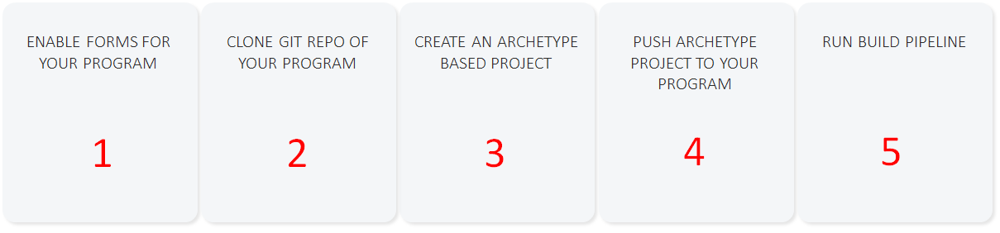
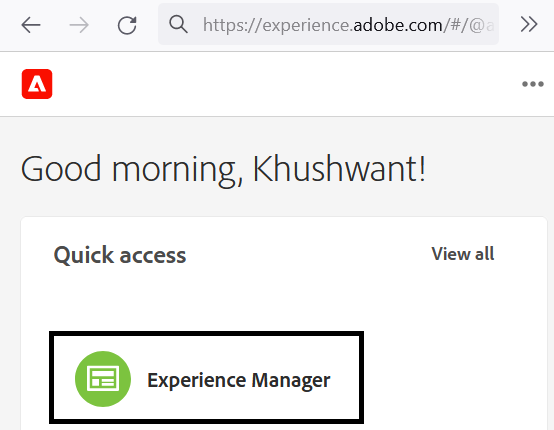
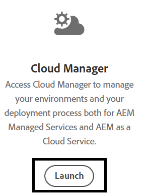
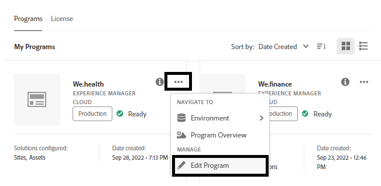
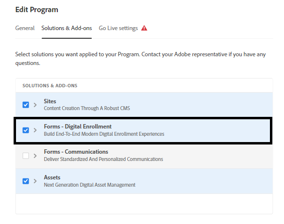
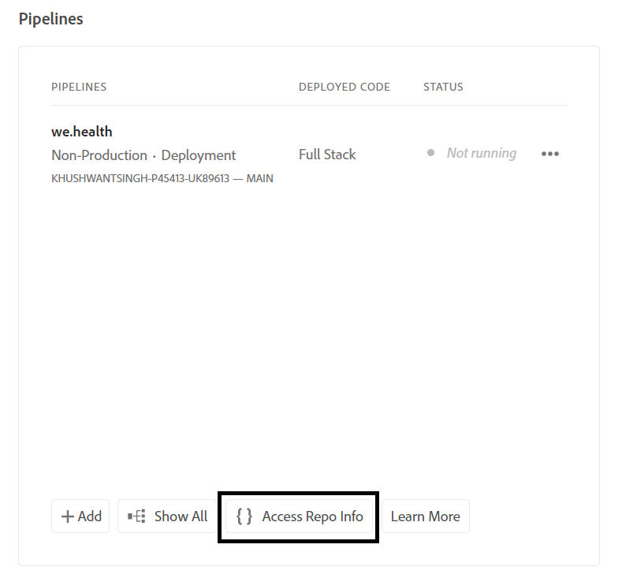
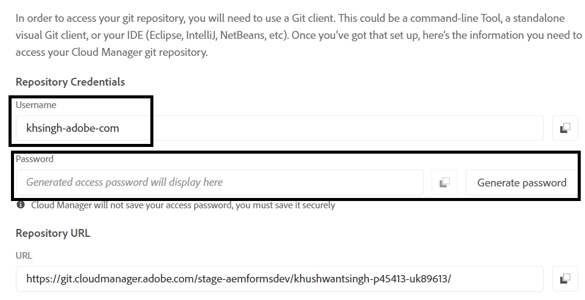
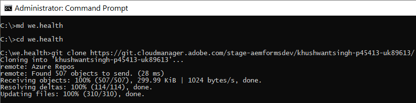
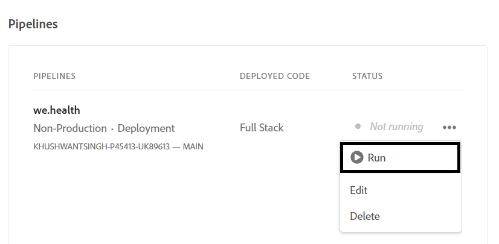

# Configurar ambiente de desenvolvimento para formulários adaptáveis headless no Cloud Service

<span class="preview"> Este é um **TRABALHO EM ANDAMENTO** artigo.</span>


Pronto para criar e testar formulários adaptáveis headless no Cloud Service? Habilite o Forms para o seu programa Cloud Service e comece logo.

## Antes de começar

* Instalar [Versão mais recente do Git](https://git-scm.com/downloads) no computador local. Se você é novo no Git, consulte [Instalação do Git](https://git-scm.com/book/en/v2/Getting-Started-Installing-Git). Você usa o repositório Git para enviar os formulários e o código personalizado desenvolvidos em seu ambiente de desenvolvimento local para seu ambiente de desenvolvimento de Cloud Service.

* Instalar [Node.js 16.13.0 ou posterior](https://nodejs.org/en/download/) no computador local. Se você é novo no Node.js, consulte [Como instalar o Node.js](https://nodejs.dev/en/learn/how-to-install-nodejs).

* Crie um programa as a Cloud Service AEM: Siga as etapas 1 a 7 do [criar programa](https://experienceleague.adobe.com/docs/experience-manager-cloud-service/content/onboarding/demo-add-on/create-program.html?#create-program) artigo para criar um programa para sua organização.

* Ativar [Canal de pré-lançamento para seu programa Cloud Service](https://experienceleague.adobe.com/docs/experience-manager-cloud-service/content/release-notes/prerelease.html?cloud-environments).

## Configurar fluxo de trabalho

Para ativar formulários adaptáveis headless na sandbox Forms as a Cloud Service, ative `Forms - Digital enrolment` para seu programa AEM Cloud Service, crie um projeto com base no Archetype 37 ou posterior em seu computador local e envie-o para o ambiente as a Cloud Service do Forms. O processo completo é:



### 1. Ativar o Forms para o seu programa

<table style="table-layout:auto">
<tr>
  <td>
  1. Faça logon no <a href="https://experience.adobe.com/" > https://experience.adobe.com/ </a>  e selecione o <b> Experience Manager </b> opção.
  </td>
  <td>
    <a href="https://experienceleague.adobe.com/docs/experience-manager-cloud-service/content/onboarding/demo-add-on/create-program.html?#create-program">
      
    </a>
    <br>
  </td>
</tr>
<tr>
  <td>
  2. Para efeitos da <b> Cloud Manager </b> clique em <b> Iniciar. </b> Uma lista de programas para sua organização é exibida.
  </td>
  <td>
    <a href="https://experienceleague.adobe.com/docs/experience-manager-cloud-service/content/onboarding/demo-add-on/create-program.html?#create-program">
      
    </a>
    <br>
  </td>
</tr>
<tr>
  <td>
    3. Para o seu programa, toque no ... ícone e selecione o <b> Editar programa </b> opção. Uma caixa de diálogo é exibida. 
  </td>
  <td>
    <a href="https://experienceleague.adobe.com/docs/experience-manager-cloud-service/content/onboarding/demo-add-on/create-program.html?#create-program">
      
    </a>
    <br>
  </td>
</tr>
<tr>
  <td>
    4. Na caixa de diálogo Editar programa, vá para a <b> Guia Soluções e complementos </b>, selecione o <b> Forms - Inscrição digital </b> e toque em <b> atualizar </b>. 
  </td>
  <td>
    <a href="https://experienceleague.adobe.com/docs/experience-manager-cloud-service/content/onboarding/demo-add-on/create-program.html?#create-program">
      
    </a>
    <br>
  </td>
</tr>
</table>

### 2. Clonar o repositório Git do programa no computador local

Todo programa as a Cloud Service do AEM tem um repositório Git. Ele permite fazer upload de código personalizado e ativos da máquina local para o ambiente Cloud Service. Durante a configuração, usamos o repositório Git para trazer códigos, modelos e outras informações relacionados aos formulários adaptáveis headless para o programa Cloud Service de seu computador local. A clonagem do repositório Git de Cloud Service em seu computador local é a primeira etapa para trazer o código personalizado e o conteúdo de seu computador local para Cloud Service.

>[!INFO]
>
> Você sempre pode confirmar em um repositório Git sem cloná-lo. Mas ela tem seus próprios caprichos. Então, estamos usando a abordagem de clonagem neste documento.


Para clonar o repositório:

<table style="table-layout:fixed">
<tr>
  <td>
  1. Na caixa de pipeline do seu programa, toque em <b> Acessar informações do repositório. </b> Uma caixa de diálogo com informações do Repositório é exibida 
  </td>
  <td>
    <a href="https://experienceleague.adobe.com/docs/experience-manager-cloud-service/content/onboarding/demo-add-on/create-program.html?#create-program">
      
    </a>
    <br>
  </td>
</tr>
<tr>
  <td>
  2. Toque <b> Gerar senha </b> e copie o <b> URL do repositório. </b> 
  </td>
  <td>
      
    <br>
  </td>
</tr>
<tr>
  <td>
    3. Na máquina local, abra o prompt de comando, crie uma pasta e execute o seguinte comando e forneça as Credenciais do Repositório, perguntado:
    </br>
    <code> git clone [Repository URL] </code> </br></br>
    Por exemplo, </br> 
    <code> git clone https://git.cloudmanager.adobe.com/stage-aemformsdev/khushwantsingh-p45413-uk89613/ </code>

</br> Quando solicitado, obtenha o <b> Nome de usuário</b> e <b>Senha</b> do <b>Informações do repositório</b> tela.
</td>
  <td>
     
  </td>
</tr>
</table>


### 3. Criar um projeto com base no Arquétipo AEM

O projeto do arquétipo é um modelo baseado no Maven. Ele cria um projeto mínimo com base na prática recomendada para começar a usar formulários adaptáveis headless. Ele também inclui a funcionalidade de formulários adaptáveis principais do Headless para o Forms as a Cloud Service. É obrigatório criar e implantar o projeto baseado no arquétipo 37 ou posterior.
®®® Dependendo do sistema operacional, execute o comando maven para criar um projeto Experience Manager Forms as a Cloud Service. Use a versão 37 ou posterior do arquétipo. Consulte [Documentação do arquétipo](https://experienceleague.adobe.com/docs/experience-manager-core-components/using/developing/archetype/overview.html?lang=pt-BR) para encontrar a versão mais recente do Arquétipo.

+++ Microsoft® Windows

1. Abra o prompt de comando com privilégios Administrativos (Execute o prompt de comando ou bash shell como administrador).
1. Execute o comando abaixo:

   ```shell
     mvn -B org.apache.maven.plugins:maven-archetype-plugin:3.2.1:generate ^
     -D archetypeGroupId=com.adobe.aem ^
     -D archetypeArtifactId=aem-project-archetype ^
     -D archetypeVersion=37 ^
     -D appTitle=myheadlessform ^
     -D appId=myheadlessform ^
     -D groupId=com.myheadlessform ^
     -D includeFormsenrollment="y" ^
     -D includeFormsheadless="y" 
   ```

™™™ * Definir `appTitle` para definir o título e os grupos de componentes.
* Definir `appId` para definir o Maven artifactId, os nomes do componente, da configuração e da pasta de conteúdo e os nomes da biblioteca do cliente.
* Definir `groupId` para definir o Maven groupId e o Pacote de origem Java™.
* Use o `includeFormsenrollment=y` opção para incluir configurações específicas do Forms, temas, modelos, Componentes principais e dependências necessárias para criar o Adaptive Forms.
* Use o `includeFormsheadless=y` opção para incluir os Componentes principais do Forms e as dependências necessárias para incluir a funcionalidade de formulários adaptáveis headless. Ao ativar essa opção, as seguintes opções são incluídas:\
* O **Em branco com componentes principais** modelo com [componentes principais](https://experienceleague.adobe.com/docs/experience-manager-core-components/using/introduction.html?lang=pt-BR).
* Um módulo de front-end do React, `ui.frontend.react.forms.af`. Ele ajuda a renderizar o formulário adaptável headless em um aplicativo react.

+++®®


+++ Apple macOS ou Linux®

1. Abra o terminal como um usuário raiz. Permite executar comandos com privilégios administrativos. Também é possível usar `sudo root` depois de abrir a janela do terminal para executar comandos com privilégios administrativos.
1. Execute o comando abaixo:

   ```shell
     mvn -B org.apache.maven.plugins:maven-archetype-plugin:3.2.1:generate \
     -D archetypeGroupId=com.adobe.aem \
     -D archetypeArtifactId=aem-project-archetype \
     -D archetypeVersion=37 \
     -D appTitle=myheadlessform \
     -D appId=myheadlessform \
     -D groupId=com.myheadlessform \
     -D includeFormsenrollment="y" \
     -D includeFormsheadless="y"  
   ```

™™™ * Definir `appTitle` para definir o título e os grupos de componentes.
* Definir `appId` para definir o Maven artifactId, os nomes do componente, da configuração, da pasta de conteúdo e da biblioteca do cliente.
* Definir `groupId` para definir o Maven groupId e o Pacote de origem Java™.
* Use o `includeFormsenrollment=y` opção para incluir configurações específicas do Forms, temas, modelos, Componentes principais e dependências necessárias para criar o Adaptive Forms.
* Use o `includeFormsheadless=y` opção para incluir os Componentes principais do Forms e as dependências necessárias para incluir a funcionalidade de formulários adaptáveis headless. Ao ativar essa opção, as seguintes opções são incluídas:\
* O **Em branco com componentes principais** modelo com [componentes principais](https://experienceleague.adobe.com/docs/experience-manager-core-components/using/introduction.html?lang=pt-BR).
* Um módulo de front-end reage, `ui.frontend.react.forms.af`. Ele ajuda a renderizar o formulário adaptável headless em um aplicativo react.

+++

Ao concluir com êxito o comando, uma pasta de projeto com o nome especificado no `appID` é criado. Por exemplo, se você usar `appID` com valor `myheadlessform`, uma pasta chamada `myheadlessform` é criado. Ele contém o projeto baseado em Arquétipo.

### 4. Encaminhar o projeto baseado no Arquétipo AEM para o seu ambiente Cloud Service

1. Substitua o conteúdo do repositório Git pelo conteúdo do projeto baseado em Arquétipo.

   >[!VIDEO](https://video.tv.adobe.com/v/3409809/)

1. Abra o prompt de comando, navegue até a pasta Repositório Git e execute os comandos abaixo na ordem listada para fazer upload do conteúdo substituído para o seu ambiente Cloud Service. Você também pode usar um editor visual em vez de usar os comandos abaixo para enviar conteúdo para o repositório Cloud Service.

   ```
      git add .
      git commit
      git push origin
   ```

### 5. Execute o pipeline de build para seu programa


<table style="table-layout:auto">
<tr>
  <td>
  1. Faça logon no <a href="https://experience.adobe.com/" > https://experience.adobe.com/ </a>  e selecione o <b> Experience Manager </b> opção.
  </td>
  <td>
    <a href="https://experienceleague.adobe.com/docs/experience-manager-cloud-service/content/onboarding/demo-add-on/create-program.html?#create-program">
      
    </a>
    <br>
  </td>
</tr>
<tr>
  <td>
  2. Para efeitos da <b> Cloud Manager </b> clique em <b> Iniciar. </b> Uma lista de programas para sua organização é exibida. Abra o programa. 
  </td>
  <td>
    <a href="https://experienceleague.adobe.com/docs/experience-manager-cloud-service/content/onboarding/demo-add-on/create-program.html?#create-program">
      
    </a>
    <br>
  </td>
</tr>
<tr>
  <td>
    3. Para o pipeline, toque no ... ícone e selecione o <b> Executar </b> opção. Se for solicitado a executar o pipeline, toque em <b> Executar </b> e aguardar o pipeline <b> Status </b>  para alterar para <b> Concluído </b>.  
  </td>
  <td>
    <a href="https://experienceleague.adobe.com/docs/experience-manager-cloud-service/content/onboarding/demo-add-on/create-program.html?#create-program">
      
    </a>
    <br>
  </td>
</tr>
</table>

Agora, seu ambiente está pronto para usar formulários adaptáveis headless. Agora é possível carregar a definição JSON de um formulário no seu ambiente Cloud Service, criar um formulário adaptável headless com base nele e usar o [getForm](https://opensource.adobe.com/aem-forms-af-runtime/api/#tag/Get-Form-Definition/operation/getForm) e outras APIs rest para usar o formulário adaptável Headless em seu aplicativo ou serviço.
