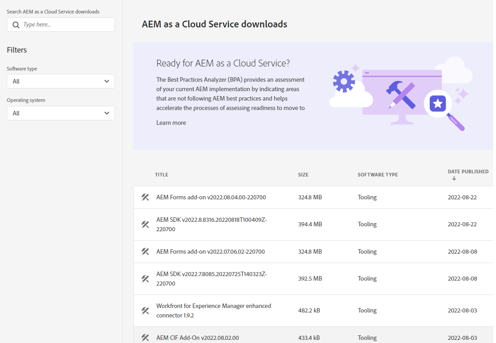
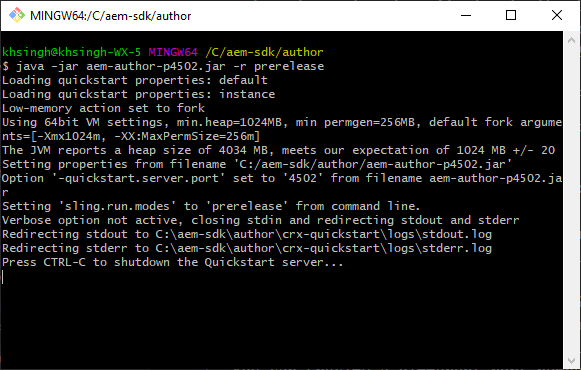

# Configuração de um ambiente de desenvolvimento local {#headless-adaptive-forms-setup-development-environment}

Você pode configurar um ambiente de desenvolvimento local para criar e testar formulários adaptáveis headless em sua máquina local. O ambiente de desenvolvimento consiste no SDK do AEM e no AEM Forms Feature Archive instalado no SDK do AEM.
<!--
 After a Headless adaptive form or related assets are ready on the local development environment, you can deploy the Headless adaptive form application to your publishing environment. -- >

You require knowledge to build application using react, Git, and Maven to use Headless adaptive forms.

<!-- 

### Download the latest version of AEM as a Cloud Service SDK or Forms feature archive (AEM Forms add-on) from Software Distribution {#software-distribution}

To download the supported version of Adobe Experience Manager as a Cloud Service SDK or Forms feature archive (AEM Forms add-on):

1. Log in to [Software Distribution](https://experience.adobe.com/#/downloads) portal with your Adobe ID.

    >[!NOTE]
    >
    > Your Adobe Organization must be provisioned for AEM as a Cloud Service to download the AEM as a Cloud Service SDK.

1. Navigate to the **[!UICONTROL AEM as a Cloud Service]** tab.
1. Sort by published date in descending order.
1. Click on the latest Adobe Experience Manager as a Cloud Service SDK or Forms feature archive (AEM Forms add-on).
1. Review and accept the EULA. Tap the **[!UICONTROL Download]** button. -->

## Requisitos do sistema {#headless-adaptive-forms-system-requirements}

Para instalar o SDK do AEM, o computador local deve atender aos seguintes requisitos mínimos:

* [Java Development Kit 11](https://experience.adobe.com/#/downloads/content/software-distribution/en/general.html?1_group.propertyvalues.property=.%2Fjcr%3Acontent%2Fmetadata%2Fdc%3AsoftwareType&amp;1_group.propertyvalues.operation=equals&amp;1_group.propertyvalues.0_values=software-type%3Atooling&amp;fulltext=Oracle%7E+JDK%7E+11%7E&amp;orderby=%40jcr%3Acontent%2Fjcr%3AlastModified&amp;orderby.sort=desc&amp;layout=list&amp;p.offset=0&amp;p.limit=11)
* [Versão mais recente do Git](https://git-scm.com/downloads). Se você é novo no Git, consulte [Instalação do Git](https://git-scm.com/book/en/v2/Getting-Started-Installing-Git).
* [Node.js 16.13.0 ou posterior](https://nodejs.org/en/download/). Se você é novo no Node.js, consulte [Como instalar o Node.js](https://nodejs.dev/en/learn/how-to-install-nodejs).
* [Maven 3.6 ou posterior](https://maven.apache.org/download.cgi). Se você é novo no Maven, consulte [Instalação do Apache Maven](https://maven.apache.org/install.html).

## Configurar ambiente de desenvolvimento {#headless-adaptive-forms-procedure-to-setup-development-environment}

Para configurar um novo ambiente de desenvolvimento local e usá-lo para desenvolver e testar formulários adaptáveis headless:

1. [Configurar o SDK as a Cloud Service do AEM](#setup-author-instance).
1. [Adicionar o arquivamento do AEM Forms (complemento AEM Forms Cloud Service) ao SDK do AEM](#add-forms-archive).

<!--

1. (Optional) [Add Forms-specific users to your local Author instance](#configure-users-and-permissions).
1. (Optional) Install [Adaptive forms builder extension for Microsoft Visual Studio Code](#microsoft-visual-studio-code-extension-for-headless-adaptive-forms). 

-->

### 1. Configurar o SDK as a Cloud Service do AEM {#setup-author-instance}

O SDK as a Cloud Service do AEM (AEM SDK) fornece aos desenvolvedores uma experiência local para criar e testar formulários adaptáveis headless. Você pode usar o SDK as a Cloud Service do AEM para criar e visualizar formulários adaptáveis headless, permitindo executar a maioria das validações relacionadas ao desenvolvimento localmente. Para configurar uma instância de autor local:

1. [Baixar](https://experience.adobe.com/#/downloads/content/software-distribution/en/aemcloud.html) o mais recente [!DNL Adobe Experience Manager] as a Cloud Service SDK. Use a coluna Data de publicação para classificar e localizar facilmente o SDK mais recente.
Ela está no formato .zip. A versão compatível é aem-sdk-2022.7.8085.20220725T140323Z-220700.zip e posterior.

   


1. Extraia o arquivo .zip baixado para um diretório em sua máquina local.
1. Crie um diretório em sua máquina local para servir como local de instalação para a instância do autor. Por exemplo, `~/aem-sdk/author`.
1. Copie o arquivo .jar dos arquivos do SDK extraídos para o local de instalação e renomeie o arquivo para `aem-author-p4502.jar`. A variável `p4502` string no nome do arquivo especifica o número da porta a ser usada. Você também pode especificar um número de porta diferente.

   >[!NOTE]
   >
   > Não clique duas vezes no arquivo .jar para iniciá-lo. Isso resulta em uma [erro](https://experienceleague.adobe.com/docs/experience-manager-learn/cloud-service/local-development-environment-set-up/aem-runtime.html?lang=en#troubleshooting-double-click).

1. Abra o prompt de comando:
   * No Windows, use o **Executar como administrador** opção para abrir o prompt de comando no modo elevado.
   * No Linux, abra a janela do terminal como um usuário raiz.

1. Navegue até o local de instalação que contém o arquivo .jar copiado e execute o seguinte comando:

   `java -jar aem-author-p4502.jar -r prerelease`

   

   * A variável `-r prerelease` o switch ativa os recursos disponíveis somente nos programas de pré-lançamento e lançamento limitado.
   * Você pode usar `admin` como nome de usuário e senha para desenvolvimento local para reduzir a carga cognitiva.

   Depois que o AEM é iniciado, a página de logon é aberta no navegador da Web. Também é possível abrir a página de logon da instância do SDK do AEM no endereço `http://localhost:<port>` no navegador da Web. Por exemplo, [http://localhost:4502](http://localhost:4502).

1. Faça logon na instância do Author. Toque no  toque em Sobre o Adobe Experience Manager e verifique se o número da versão inclui o sufixo PRÉ-LANÇAMENTO.

   Ajuda com o 

Se você não vir o sufixo PRÉ-LANÇAMENTO, pare o servidor, exclua o `[AEM SDK installation]/crx-quickstart folder`e reinicie o arquivo .jar do SDK do AEM com `-r prerelease` interruptor. Para obter mais opções, consulte [Solução de problemas](/help/troubleshooting.md).

### 2. Adicionar o arquivo do AEM Forms (complemento AEM Forms Cloud Service) ao SDK do AEM {#add-forms-archive}

O arquivo de recursos as a Cloud Service do AEM Forms (complemento AEM Forms Cloud Service) fornece ferramentas para criar formulários adaptáveis headless em um ambiente de desenvolvimento local. Para instalar o arquivo de recursos:

1. Baixe e extraia a versão mais recente [!DNL AEM Forms] arquivo de recursos (complemento do AEM Forms) de [Distribuição de software](https://experience.adobe.com/#/downloads/content/software-distribution/en/aemcloud.html?fulltext=AEM*+Forms*+add*+on*&amp;orderby=%40jcr%3Acontent%2Fjcr%3AlastModified&amp;orderby.sort=desc&amp;layout=list&amp;p.offset=0&amp;p.limit=20). Use a coluna Data de publicação para classificar e localizar facilmente o SDK mais recente. A versão compatível é aem-forms-addon-2022.07.06.02-220600 e posterior.

1. Navegue até o diretório crx-quickstart/install. Caso a pasta não exista, crie-a.
1. Pare sua instância do SDK do AEM. É possível encerrar a janela do prompt de comando que está executando a instância do SDK do AEM para interromper o AEM.
1. Copie o [!DNL AEM Forms] arquivo de recurso complementar do arquivo, `aem-forms-addon-<version>.far`, extraído na etapa 1 para a pasta de instalação.
1. Use o seguinte comando para reiniciar a instância do SDK do AEM:

   `java -jar aem-author-p4502.jar -r prerelease`

<!-- 

### 3. (Optional) Configure users and permissions {#configure-users-and-permissions}

Create seperate user accounts for Form Developer, Form Practitioner, and end users. These account help you test Headless adaptive forms for various types of users. To create a user account and add roles to the account:

1. Login to your AEM SDK instance.
1. Go to Tools > Security > Users and tap Create. The Create New User wizard opens.
1. In the details tab, specify an ID and Password. All other fields are optional. It is recommended to provide name and an email address.
1. In the Groups tab, search and select user-groups for a user depending on their role. The table below lists all types of users and pre-defined groups for each type of forms users based on their role:
  
    | User Type | AEM Group |
    |---|---|
    | Form developer | [!DNL forms-users] (AEM Forms Users), [!DNL template-authors], [!DNL workflow-users], [!DNL workflow-editors], and [!DNL fdm-authors]  |
    | Customer Experience Lead or UX Designer| [!DNL forms-users], [!DNL template-authors]|
    | AEM administrator | [!DNL aem-administrators], [!DNL fd-administrators] |
    | End user| When a user must log in to view and submit an Adaptive Form, add such users to [!DNL forms-users] group. </br> When no user authentication is required to access Adaptive Forms, do not assign any group to such users.|

<!-- ### 4. (Optional) Install Visual Studio Code extension for Headless adaptive forms {#microsoft-visual-studio-code-extension-for-headless-adaptive-forms}

You can use any IDE for developing Headless adaptive forms. Adobe provides an extension for Microsoft&reg;reg; Visual Studio Code to make it easier for you to navigate structure and develop Headless adaptive forms. The extension adds adaptive forms related IntelliSense capabilities and helps auto-complete Headless adaptive forms JSON syntax. It also adds a panel, titled Forms Tree, to help navigate structure of Headless adaptive form. To use the extension: 

1. Ensure [Microsoft Visual Studio Code 1.62.0 or later](https://code.visualstudio.com/docs/supporting/FAQ#_how-do-i-find-the-version) is installed. If you have an older version or no version installed, download the latest version from [Microsoft Website](https://code.visualstudio.com/docs/setup/setup-overview)
   >[!NOTE]
   >
   >
   > To use Visual Studio from command line on macOS, see [Launching from the command line](https://code.visualstudio.com/docs/setup/mac#_launching-from-the-command-line).

1. Download the [Adaptive forms builder extension](/help/assets/adaptive-form-builder-0.12.0.vsix).

1. Navigate the directory containing the *adaptive-form-builder-[version].vsix* file.

1. Run the following command or see [Install from a VSIX](https://code.visualstudio.com/docs/editor/extension-marketplace#_install-from-a-vsix) article for detailed instructions to install a Visual Studio Code extension from a VSIX file:

    `code -–install-extension adaptive-form-builder-[version].vsix`

    </br> Replace the [version] with actual version of the extension. For example, `code -–install-extension adaptive-form-builder-0.12.0.vsix`

    </br> 

    

<!-- ## Create and setup a react app

Adaptive forms renderer component is a react based component. It requires a react app to run and render a Headless adaptive form. To create and setup react app:

1. Open terminal in Visual Studio code and run the following command to create a react app and installs all related dependencies:

    ```shell
    npx create-react-app [react-app-name] --scripts-version 4.0.3 --template typescript
    ```

    Where [react-app-name] represents name of the project, script version is 4.0.3, and template of type typescript. For example, the following command creates a react app named *headless-forms-demo*.

    ```shell
    npx create-react-app headless-forms-demo --scripts-version 4.0.3 --template typescript
    ```

    It may take some time to create the react app and install all the dependencies. The command creates an empty react app with latest version of react and react-dom dependencies. It does not have any artifacts related to adaptive forms renderer component.

1. Adaptive forms renderer component is based on react spectrum and requires react 16.0.0 and react-dom 16.0.0. To install react 16.0.0 and related dependencies:
    1. Open the Visual Studio code terminal Window or command prompt.
    1. Navigate to the directory of react project.  
    1. Run the following command:

        ```shell
        npm install --save react@16.0.0 react-dom@16.14.0 -force
        ```

1. Run the following command to install adaptive forms renderer component related dependencies:

    ```shell
    npm i --save @aemforms/forms-super-component @aemforms/forms-react-core-components @aemforms/forms-super-component @adobe/react-spectrum @react/react-spectrum
    ```

<!-- 1. Install dependencies for adaptive forms renderer component. Packages for these dependencies are available in Adobe Artifactory. To authenticate with Adobe Artifactory and install dependencies for adaptive forms renderer component:

    1. Create environment variables ARTIFACTORY_USER and ARTIFACTORY_API_TOKEN. The ARTIFACTORY_USER stores Adobe LDAP username and ARTIFACTORY_API_TOKEN stores your [Adobe Artifactory token](https://wiki.corp.adobe.com/display/Artifactory/API+Keys)

    1. Run the following command to set NPM_TOKEN and NPM_EMAIL tokens:

        ```shell

        auth=$(curl -s -u${ARTIFACTORY_USER}:${ARTIFACTORY_API_TOKEN} https://artifactory.corp.adobe.com/artifactory/api/npm/auth)
        export NPM_TOKEN=$(echo "${auth}" | grep "_auth" | awk -F " " '{ print $3 }')
        export NPM_EMAIL=$(echo "${auth}" | grep "email" | awk -F " " '{ print $3 }')
        ```

        These tokens are required to communicated with Adobe Artifactory.

    1. Create a .npmrc file in the react project.

        

    1. Add the following code to the file:

        ```shell
        @aemforms:registry=https://artifactory.corp.adobe.com/artifactory/api/npm/npm-aem-release/
        @react:registry=https://artifactory.corp.adobe.com/artifactory/api/npm/npm-react-release/
        @quarry:registry=https://artifactory.corp.adobe.com/artifactory/api/npm/npm-adobe-release-local/
        //artifactory.corp.adobe.com/artifactory/api/npm/npm-adobe-release-loca/:_auth=${NPM_TOKEN}
        //artifactory.corp.adobe.com/artifactory/api/npm/npm-aem-release/:_auth=${NPM_TOKEN}
        //artifactory.corp.adobe.com/artifactory/api/npm/npm-react-release/:_auth=${NPM_TOKEN}
        _auth=${NPM_TOKEN}
        email=${NPM_EMAIL}
        always-auth=true
        ```

        It defines the antifactory repositories to use for Headless adaptive forms, react, and quarry related scope.
    1. Run the following command to install adaptive forms renderer component related dependencies:

    ```shell
    npm i --save @aemforms/crispr-react-bindings @aemforms/crispr-react-core-components @adobe/react-spectrum @react/react-spectrum
    ```
 
-->
O ambiente local está pronto. Você pode prosseguir para a criação de um formulário adaptável Headless.
