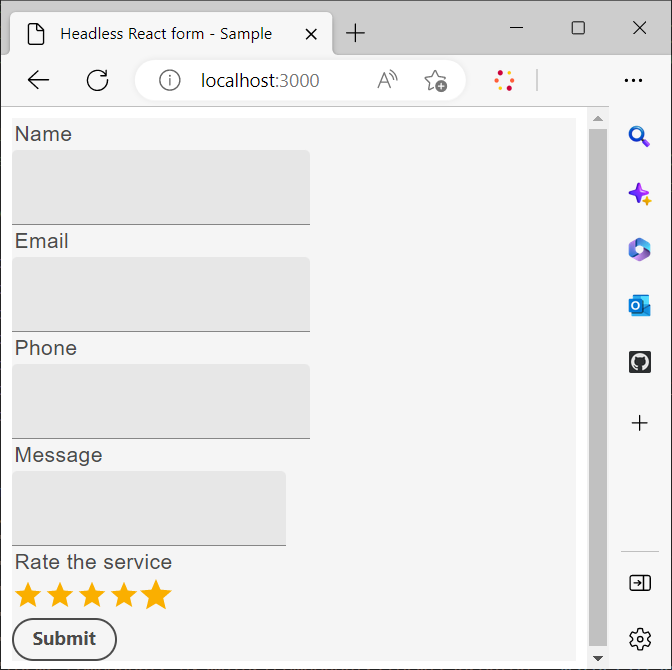
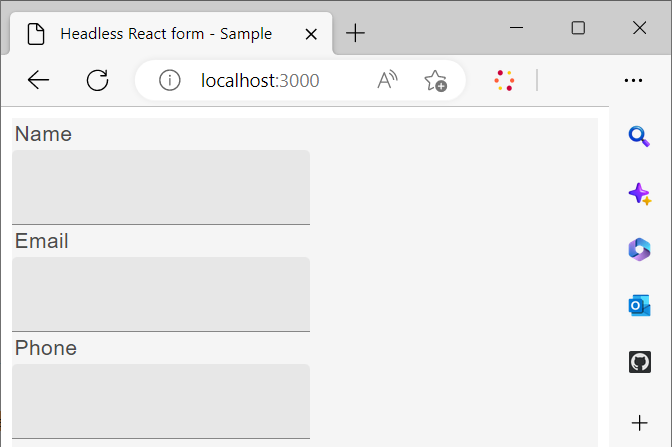

# Usar uma biblioteca de reação personalizada para renderizar um formulário headless

Você pode criar e implementar componentes personalizados para personalizar a aparência e a funcionalidade (Comportamento) de seus formulários adaptáveis headless de acordo com os requisitos e as diretrizes de sua organização.

Esses componentes atendem a dois objetivos principais: controlar a aparência ou o estilo dos campos de formulário e armazenar os dados coletados por meio desses campos na instância do modelo de formulário. Se isso parecer confuso, não se preocupe - exploraremos esses propósitos em mais detalhes em breve. Por enquanto, vamos nos concentrar nas etapas iniciais de criação de componentes personalizados, renderização do formulário usando esses componentes e utilização dos eventos para salvar e enviar dados para um endpoint REST.

Neste tutorial, os componentes da interface do usuário de materiais do Google são empregados para demonstrar como renderizar um formulário adaptável headless usando componentes personalizados do React. No entanto, você não está limitado a esta biblioteca e pode utilizar qualquer biblioteca de componentes do React ou desenvolver seus próprios componentes personalizados.

Na conclusão do presente artigo, a Comissão _Entre em contato_ formulário criado em [Criar e publicar um formulário headless usando o kit inicial](create-and-publish-a-headless-form.md) O artigo se transforma no seguinte:




As principais etapas envolvidas no uso dos componentes da interface do usuário de material do Google para renderizar um formulário são:


## 1. Instalar a interface do usuário de material do Google

Por padrão, o kit inicial usa [Adobe Espectro](https://spectrum.adobe.com/) componentes. Vamos configurá-lo para uso [Interface do usuário de material da Google](https://mui.com/):

1. Verifique se o kit inicial não está em execução. Para interromper o kit inicial, abra o terminal, navegue até o **react-starter-kit-aem-headless-forms**, e pressione Ctrl-C (é o mesmo no Windows, Mac e Linux).

   Não tente fechar o terminal. Fechar o terminal não interrompe o kit inicial.

1. Execute o seguinte comando:

```shell
    
    npm install @mui/material @emotion/react @emotion/styled --force
    
```

Ele instala as bibliotecas npm da interface do usuário do Google Material e adiciona as bibliotecas às dependências dos kits de início. Agora você pode usar os componentes da Interface do usuário do material para renderizar componentes de formulário.


## 2. Criar componentes personalizados do React

Vamos criar um componente personalizado que substitua o padrão [entrada de texto](https://spectrum.adobe.com/page/text-field/) componente com [Campo de texto da interface do usuário de material do Google](https://mui.com/material-ui/react-text-field/) componente.

É necessário um componente separado para cada tipo de componente ([fieldType](https://opensource.adobe.com/aem-forms-af-runtime/storybook/?path=/story/reference-json-properties-fieldtype--text-input) ou :type) usada em uma definição de Formulário Headless. Por exemplo, no formulário Fale Conosco criado na seção anterior, os campos Nome, Email e Telefone do tipo `text-input` ([fieldType: &quot;text-input&quot;](https://opensource.adobe.com/aem-forms-af-runtime/storybook/?path=/docs/adaptive-form-components-text-input-field--def)) e o campo de mensagem for do tipo `multiline-input` ([&quot;fieldType&quot;: &quot;multiline-input&quot;](https://opensource.adobe.com/aem-forms-af-runtime/storybook/?path=/docs/reference-json-properties-fieldtype--multiline-input)).


Vamos criar um componente personalizado para sobrepor todos os campos de formulário que usam [fieldType: &quot;text-input&quot;](https://opensource.adobe.com/aem-forms-af-runtime/storybook/?path=/docs/adaptive-form-components-text-input-field--def) propriedade com [Campo de texto da interface do usuário de material](https://mui.com/material-ui/react-text-field/) componente.


Para criar o componente personalizado e mapeá-lo com a tag [fieldType](https://opensource.adobe.com/aem-forms-af-runtime/storybook/?path=/docs/adaptive-form-components-text-input-field--def) propriedade:

1. Abra o **react-starter-kit-aem-headless-forms** em um editor de código e navegue até `\react-starter-kit-aem-headless-forms\src\components`.


1. Crie uma cópia do **controle deslizante** ou **richtext** e renomeie a pasta copiada para **materialtextfield**. O controle deslizante e o richtext são dois componentes personalizados de amostra disponíveis no aplicativo inicial. Você pode usá-los para criar seus próprios componentes personalizados.

   

1. Abra o `\react-starter-kit-aem-headless-forms\src\components\materialtextfield\index.tsx` e substitua o código existente pelo código abaixo. Esse código retorna e renderiza um [Campo de texto da interface do usuário de material do Google](https://mui.com/material-ui/react-text-field/) componente.

```JavaScript
 
     import React from 'react';
     import {useRuleEngine} from '@aemforms/af-react-renderer';
     import {FieldJson, State} from '@aemforms/af-core';
     import { TextField } from '@mui/material';
     import Box from '@mui/material/Box';
     import { richTextString } from '@aemforms/af-react-components';
     import Typography from '@mui/material/Typography';


     const MaterialtextField = function (props: State<FieldJson>) {

         const [state, handlers] = useRuleEngine(props);

         return(

         <Box>
             <Typography component="legend">{state.visible ? richTextString(state?.label?.value): ""} </Typography>
             <TextField variant="filled"/>
         </Box>

         )
     }

     export default MaterialtextField;
```


A variável `state.visible` A peça verifica se o componente está definido para ficar visível. Se for, o rótulo do campo será recuperado e exibido usando `richTextString(state?.label?.value)`.


Seu componente personalizado `materialtextfield` está pronto. Vamos definir este componente personalizado para substituir todas as instâncias de  [fieldType: &quot;text-input&quot;](https://opensource.adobe.com/aem-forms-af-runtime/storybook/?path=/docs/adaptive-form-components-text-input-field--def) com o Campo de texto da interface do usuário de material do Google.

## 3. Mapear componente personalizado com campos de formulário headless

O processo de usar componentes de biblioteca de terceiros para renderizar campos de formulário é conhecido como mapeamento. Você mapeia cada um ([fieldType](https://opensource.adobe.com/aem-forms-af-runtime/storybook/?path=/story/reference-json-properties-fieldtype--text-input)) ao componente correspondente da biblioteca de terceiros.

Todas as informações relacionadas ao mapeamento são adicionadas à `mappings.ts` arquivo. A variável `...mappings` na instrução `mappings.ts` arquivo refere-se aos mapeamentos padrão, que sobrepõem o ([fieldType](https://opensource.adobe.com/aem-forms-af-runtime/storybook/?path=/story/reference-json-properties-fieldtype--text-input) ou :type) com [Espectro de Adobe](https://spectrum.adobe.com/page/text-field/) componentes.

Para adicionar mapeamento para o  `materialtextfield` criado na última etapa:

1. Abra o `mappings.ts` arquivo.

1. Adicione a seguinte declaração de importação para incluir a `materialtextfield` componente para a `mappings.ts` arquivo:


   ```JavaScript
       import MaterialtextField from "../components/materialtextfield";
   ```

1. Adicione a seguinte instrução para mapear o `text-input` com o componente materialtextfield.


   ```JavaScript
       "text-input": MaterialtextField
   ```

   O código final do arquivo é semelhante ao seguinte:

   ```JavaScript
         import { mappings } from "@aemforms/af-react-components";
         import MaterialtextField from "../components/materialtextfield";
   
   
         const customMappings: any = {
           ...mappings,
           "text-input": MaterialtextField
        };
        export default customMappings;
   ```

1. Salve e execute o aplicativo. Os três primeiros campos do formulário são renderizados usando [Campo de texto da interface do usuário de material do Google](https://mui.com/material-ui/react-text-field/):

   


   Da mesma forma, você pode criar componentes personalizados para campos de mensagem (&quot;fieldType&quot;: &quot;multiline-input&quot;) e classificar os campos de serviço (&quot;fieldType&quot;:&quot;number-input&quot;). Você pode clonar o seguinte repositório Git para componentes personalizados de mensagem e classificar os campos de serviço:

   [https://github.com/singhkh/react-starter-kit-aem-headless-forms](https://github.com/singhkh/react-starter-kit-aem-headless-forms)

## Próxima etapa

Você renderizou o formulário com sucesso com componentes personalizados que usam a interface do usuário de materiais do Google. Você tentou enviar o formulário clicando no botão Enviar (mapeado com o componente de interface do usuário do material do Google correspondente)? Caso contrário, vá em frente e experimente.

O formulário está enviando os dados para alguma fonte de dados? Não? Não se preocupe. Isso ocorre porque o formulário não está configurado para se comunicar com a biblioteca de tempo de execução.

Como você pode configurar o formulário para se comunicar com ele? Temos um artigo em breve que explicará tudo em detalhes. Fique atento!
